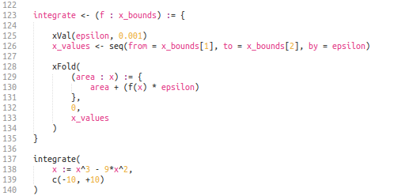

Arrow pre-v0.1.0
-----------------------------------

**DISCLAIMER: Arrow is in heavy development and is highly liable to change.**

Arrow is an opinionated toolset of more than one hundred functions from languages
like Haskell, JavaScript, and functions designed just for R. These
include familiar functions like Map, Select, Reduce and Compose, as
well as many functions for working with na values, reshaping collections,
composing functions and manipulating strings.

I hope you enjoy using Arrow as much as I've enjoyed making it. 
If you'd like to contribute with feedback, bug-reports or code 
you can go to the Arrow [github repository](https://github.com/rgrannell1/arrow). 
Any feedback is appreciated.

For library documentation and tutorials head to 
[http://rgrannell1.github.io/arrow/](http://rgrannell1.github.io/arrow/).


### What Arrow code looks like.

 </img>

### Arrow is Expressive

* Programs are built in a lego-like manner; stacking small,
uniquely-purposed functions into a larger program.

* Like Ruby and JavaScript, Arrow has a shorthand syntax
for creating functions to R.

* Arrow implements jQuery-like chaining methods without using R's bulkier
object-orientation systems. These methods are just as usable as those in
Python or JavaScript. This syntax is handy for interactive programming.

* Arrow uses consistent naming conventions to make its functions more predictable.

* Almost every function has a variadic and non-variadic form, to
reduce boilerplate code.

* Arrow adds collection-comprehensions; an expressive syntax 
for creating collections.

### Arrow is Consistent

* Functions don't discriminate between different types of vectors; lists, pairlists
and typed vectors are all interchangable.

* Extensive effort was made to make sure that Arrow never throws
a cryptic error - arguments are always explicitly checked, and the precise
cause of the error is always given. Error messages are also coloured for readability.

* Arrow is interoperable with base R functions.

### Arrow is Functional

* Arrow implements all the standard higher-order functions,
as well as set operations and combinatoric functions.

* Several variants of the most common functionals are implemented,
including several flavours of map and fold.

* A new control statement - the ```Return( )``` function - can
be used to improve the efficiency of functional code.

* Partial application and function composition are encouraged
as standard operations.

## 5 Authors

Ryan Grannell.

## 6 Licensing

**Arrow** is released under the terms of the GNU General Public License version 3.

 </img>

